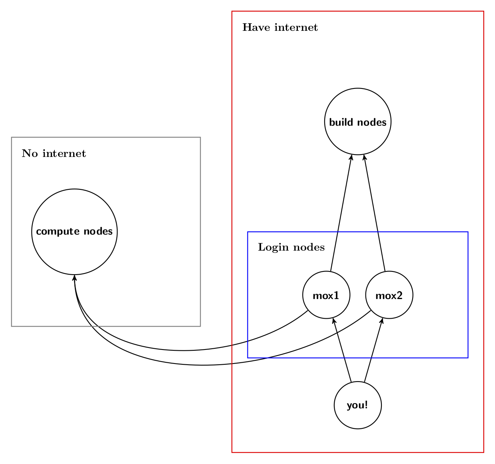
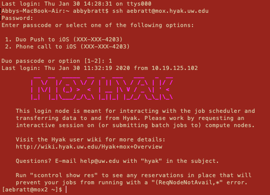
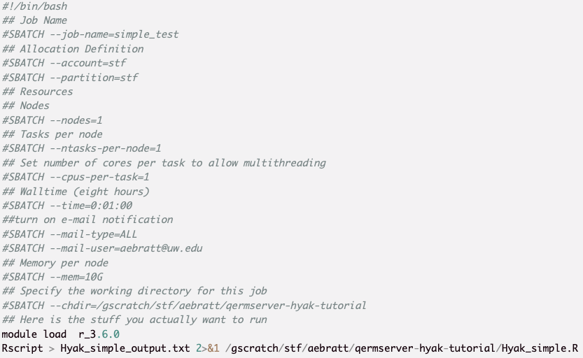
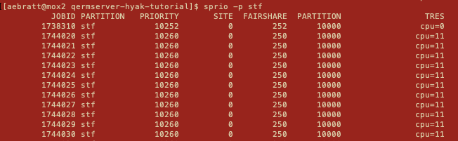

<!-- General Outline: -->
<!-- Colin (30m) - Intro to how a computer works and some parallelization exercises -->
<!-- Maria (30m) - Walk through an example on the SEFS servers -->
<!-- Abby (30m) - Walk through an example on Hyak -->

# Objectives

# Remote Servers: Why Bother?
<!-- I (Abby) think it would be good to say something about code profiling also -->
<!-- And thinking through when your code is memory intensive vs. cpu intensive, how a computer works, etc -->

## The Basics: How Do Computers Work?

- Computation: CPUs 
    - Each CPU has 1 or more cores
    - Each core can do 1 computation at a time
    - Theoretical top speed = all cores active
    - Reality: cores need to communicate
- Memory: RAM vs. not-RAM
    - RAM is volatile, extremely fast, low-volume
    - Hard drive (ex. SSD) is persistent, fairly slow, high-volume
- Sidenote: GPUs and CUDA
    - Each GPU holds 100s or 1000s of ''CUDA cores''
    - Each CUDA core is very small
    - Very fast for ''embarassingly parallel'' problems

## ''Why is my code so slow''

- The most common cases are:
    - You've run out of RAM
    - Your computer just has too many operations to do
- ''How do I make it faster''
    - Run it on a bigger computer with more RAM
    - Run it on a bigger computer with more cores

## ''Why is my code still so slow''

Before you use a remote server:

- Do some back-of-the-envelope math
- Make sure you don't need an EB of RAM or an EFLOP
- Sidenote: Units
    - kilo, mega, giga (\(10^9\)), tera (\(10^{12}\)), peta (\(10^{15}\)), exa (\(10^{18}\)), zetta, yotta
    - FLOP(S) = floating point operation (per second)
    - newish desktop might have 32 GB RAM, 25 GLOPS speed

## (Dis)advantages of parallelization

\(N\) cores may save you time up to a factor of \(N\), but:

- only if you efficiently distribute computation between cores
- only if the programmer-time it takes is small

- Sequential computation: the bane of parallel computation
- Communication: the real bane of parallel computation

## Example: Conjugate Gradient Descent {.build}

Suppose you wish to calculate \(y = Ax\) but \(A = 10^5 \times 10^5\)

Roughly speaking, \(A\) requites about \(10^{10}\) bytes or 10 GB RAM

Moreover, you need to do \(10^{10}\) multiplications or 10 GFLOPs

Not so bad, but say you want to do this \(10^6\) times (\(\approx\) 6 days)

Luckily \(y_i = \sum A_{ij}x_j\) is independent of all other rows of \(A\)

Calculating \(y_i\) \(\approx\) 10kB, 10 kFLOPs, GPU takes \(\approx\) 15 minutes

Application: conjugate gradient descent to solve \(Ax = b\)

## Recap: Why use a remote server?

- Lots of CPUs (often a few GPUs) available
- Doesn't slow down your personal computer
- Feel like a pro, brag to your friends

## Review

- When should you parallelize?
- When should you definitely not parallelize?
- When should you use a remote server?

## Practice

- MCMC
- Bootstrap
- Likelihood evaluation
- Optimization

# How to Access the QERM/SEFS Servers

# A Basic R Program

# How to Access Hyak

<!-- Outline: -->
<!-- 1. What is hyak?  -->
<!-- 2. How does hyak work? -->
<!-- 3. How to log in -->
<!-- 4. How to upload files -->
<!-- 5. How to write a batch script (things you submit to slurm) -->
<!-- 6. How to submit a job -->
<!--   6bonus - wait, what if I need a special library or piece of software? -->
<!-- 7. How to check what's happening in the queue -->
<!-- 8. How to download finished results -->
<!-- 9. How to game slurm (requesting memory, etc strategically so you get high priority) -->
<!-- 10. Where do get help doing things more advanced than this (multinode stuff, working in languages that need to be compiled, etc) -->

## What is hyak?

Hyak is a word in Chinook Jargon, meaning "fast." Chinook Jargon is the trade language of the Pacific Northwest, incorporating terms from Chinook and Chehalis and other local languages, as well as French and English. We've chosen words from Chinook Jargon for the names of systems in the UW research cyber infrastructure to emphasize their role in supporting the broad range of UW research users and our ties to our place between the mountains and Salish Sea.

--UW IT Connect

## What is hyak?

Hyak is part of an integrated, scalable, scientific super-computing infrastructure operated by UW-IT. It includes the lolo tapearchive system, a high-performance research network, **the Hyak compute infrastructure (the HPC clusters)**, and any scientific support services on making this useful in your research workflows.

--UW IT Connect

## How does hyak work?

* Within hyak, **mox** is a supercomputing **cluster**. 

* A **cluster** is a set of connected computers, **nodes**, that work together in a single system.

* In general, **clusters** are faster and more capable than a single computer or even several disconnected computers. 

## How does hyak work?

On mox, labs or groups can buy groups of nodes called **partitions**. The Research Computing Club applied for a big grant from the Student Technology Fee fund (that we all pay into every quarter!) to purchase nodes accessible to all students. 

<!-- If you want to vote on how these dollars get allocated, you can submit proposals or endorse others' proposals on the uwstf website https://uwstf.org/proposals/2020/21 -->

## How does hyak work?

 * In general, the compute nodes have the following specs:

    - 28 cores
  
    - 128 GB RAM
  
 * The STF partition is currently 92 regular nodes, plus some interactive and GPU nodes. 

 * That's a lot

## How does hyak work?

<!-- structure goes here -->

  * Login nodes (mox1, mox2)
      * Have internet
      * Use these to upload/download files and submit jobs
      * They are slow so __don't__ do heavy processing
  
  * Build nodes (n#####)
      * Have internet
      * Don't get to take a whole node (so also kinda slow)
      * Just for compiling software
  
  * Compute nodes (n#####)
      * No internet
      * Where your jobs run
      
## How does Hyak work?

Visually, this looks like:

<div class="centered">
{width=500px}
</div>
  
## How do I log in?

All nodes share the same file system.

Open a terminal window. Type

```
ssh UWNETID@mox.hyak.uw.edu
```

Follow two-factor authentication instructions. 

You're in!

## It should look like this...

<div class="centered">
{width=600px}
</div>

<!-- Only works if you have access to Hyak, of course! -->

## Exercise

Log in!

## Important locations

  * /gscratch/stf
    * Main work location for stf users
    * Any files untouched for >30 days will be scrubbed!!
  * /usr/lusers/<username>
    * Home directory
    * Only 10 GB of storage per user
  * /tmp
    * Node local storage

## How do I upload files?

From GitHub:

```
git clone git@github.com:GITHUB-USERNAME/REPO-NAME
```

From your computer:

```
scp filename UWNETID@mox.hyak.uw.edu:/path/to/destination/directory
```

## Exercise

Clone the git repo for this class to **your** scratch directory

## Exercise

Clone the git repo for this class to **your** scratch directory

**Hint:** 

From login 

```
cd /gscratch/stf
mkdir ./UWNETID
cd ./UWNETID
git clone git@github.com:GITHUB-USERNAME/REPO-NAME
cd REPO-NAME
```

**Bonus:**

Why use the scratch directory?

## What is a batch script?

 * Place to:

    - Define all the options for a job you submit to the queue

    - Set up environment (e.g. load modules)
  
    - Run!
  
 * Syntax:

    - Comment using ##
  
    - Set option using #SBATCH

## How do I write a batch script?

Short answer: don't. 

Modify a template! Here's one:

```
vim Hyak_simple_batch.sh
```

Or open this file in your favorite text editor

## It should look like this...

<div class="centered">
{width=600px}
</div>

## Exercise

Submit a job to the queue!

## Exercise

Submit a job to the queue!

**Hint:**

First, open vim or another text editor and replace UWNETID in Hyak_simple_batch.sh

```
cd /gscratch/stf/UWNETID/qermserver-hyak-tutorial
sbatch -p stf -A stf Hyak_simple_batch.sh
```

## Wait, what if I need some special library or software?

You can do that! For R libraries, 

```
mkdir /gscratch/stf/UWNETID/rpackages
srun -p build --time=2:00:00 --mem=10G --pty /bin/bash
```

We just created a directory for storing installed packages and got a session on an **interactive** build node. 

## Wait, what if I need some special library or software?

Open the command line

```
module load r_3.6.0
module list
R
install.packages("PACKAGENAME", lib="/gscratch/stf/UWNETID/rpackages")
```

Choose a mirror somewhere on the west coast and press enter. 

## Exercise

Submit a more complicated job to the queue!

**Hint:**

First, open vim or another text editor and replace UWNETID in Hyak_complicated.R and Hyak_complicated_batch.sh

```
exit
cd /gscratch/stf/UWNETID/qermserver-hyak-tutorial
sbatch -p stf -A stf Hyak_complicated_batch.sh
```

## When will my jobs run?

See the whole stf partition queue this way:

```
squeue -p stf
```

See just your jobs this way:

```
squeue -p stf -u UWNETID
```

You can also try:

```
sstat -j JOBID-RUNNING
sacct -j JOBID-COMPLETED
```

## Oops, I made a mistake!

Cancel jobs with 

```
scancel JOBID#
```

## My job finished! How do I download my results?

From Hyak to GitHub:

```
git add filename
git commit -m "informative commit message"
git push
```

From Hyak to your computer:

```
scp UWNETID@mox.hyak.uw.edu:/path/to/file .
```

## How can I get higher priority?

You can check the priority of queued jobs with
```
sprio -p stf
```
How to interpret?

It may look something like 

<div class="centered">
{width=600px}
</div>

## How can I get higher priority?

  * **TRES**: Trackable RESources (TRES) are things like cpu, memory, nodes. The more a given TRES Type is requested/allocated on a job, the greater the job priority will be for that job. Mox cares about cpu (i.e. high CPU gets high priority)
  
  * **Fair-share**: The fair-share component to a job's priority influences the order in which a user's queued jobs are scheduled to run based on the portion of the computing resources they have been allocated and the resources their jobs have already consumed. High priority to under-serviced accounts. 
  
  * Do not specify a walltime way longer than your job needs.
  
  * Specify your memory! For 128G nodes use --mem=120G or less. The operating system requires some. 
  
## What else can I do?

  * Use the checkpoint queue - run your code on other groups' unused resources
  
  * Install and build new software

## Where do I get help?

If you have trouble or you want to do more advanced stuff, check out

```
man SLURMCOMMAND
```

If all else fails, try

  * Research Computing Club
  
  * eScience Institute
  
  * UW IT
